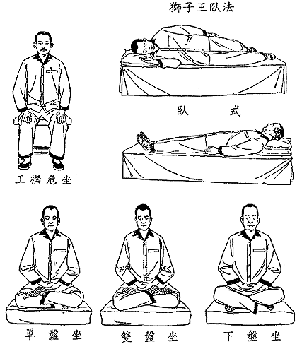

# 坐享其成

> 作者：李笑来 2016.05

坐享，也许是最简单的大脑锻炼方式，这也是人类莫名其妙地已经运用了两千五百年以上的大脑锻炼方式。已经有足够多的科学研究证明，它能使你的大脑皮层表面积加大，能使你的灰质变厚，它也能增强人们的免疫系统，它还能让人们摆脱抑郁症……

尽管简单，但也相当神奇。

虽然神奇，却又非常简单。

## 为什么要用“坐享”这个词？

“坐享”，是我杜撰的一个词 —— 当然，是一个有理由的杜撰。

所谓知识（或者知识的基石，即，概念）的三个基本要素，分别是：

> - “是什么”（what）
> - “为什么”（why）
> - “怎么做/用”（how）

人类是可以用各种手段积累知识的，这也是人类优于其它动物的一个重要因素。

说实话，人类很神奇。历史上在很多领域里，经常是在完全不知道“是什么”（what）、“为什么”（why） 的情况下，却早已经熟练掌握“怎么做”（how）……

这样的例子很多。最明显的例子是性。除了过往人类在这个领域里长期的愚昧之外，即便是到了今天也还是如此 —— “[潮吹](https://github.com/xiaolai/ji)”究竟是什么、为什么到现在也没有科学的定论，可早就有大量的人掌握了怎么做 —— 地球上第一个为人所知的、系统地掌握此项技能的，是个日本人，名字叫加藤鹰。

另外一个例子是赌博。人类貌似从一开始就带着好赌的基因，几乎每个人都天然会赌，甚至在不知道概率是什么的情况下（要知道概率论的启蒙要到 17 世纪才出现）就不仅能够熟练地赌博，还能设计出对庄家倾斜的赌博游戏……

嗯，黄、赌、毒。你看，最后一个也是如此，很多人并不知道它是什么，也不知道为什么，反正知道怎么用。其实人类在早期的时候，医也好、药也罢，都是如此的，是什么完全搞错、为什么完全弄不明白，但反正就是直接用……

从这个角度望过去，不管三七二十一，用起来再说，从来就是人类的智慧。你现在知道为什么我主张不要闲着没事儿就学外语，而是一上来就要用了罢？（详见《[人人都能用英语](https://github.com/xiaolai/everyone-can-use-english)》）

事实上，深入了解“怎么做”（how） 其实是很难的。别看人类直立行将近 100 万年，在电子工业高度发达之后的相当长一段时间里，科学家们费尽心机也造不出一个能像人一样双腿直立行走的机器人 —— 2015 年的时候，这个难题终于被攻克了，前后也居然花了全球精英差不多五十年的努力……

“坐享”这个词是我刻意造的中文词汇。在英文中，它叫 Meditation，翻译过来是“冥想”；在东方，它叫打坐、坐禅、禅修、内视、静观…… 其实“静坐”倒是个不错的词，可惜在中国它有另外的含义，不敢乱用。于是，只好生生编造了一个词：**坐享**。

为什么一定要刻意编造一个词呢？因为它现在与过往不同了，现在科学已经可以清楚地解释它的三个方面了：它是什么？为什么？怎么做？所以我们确实有必要把这个今天已经被科学证明为有效的大脑锻炼方式与过往不那么清楚或者干脆错得离谱的解释尽量区分开来。当然，另外一方面是，我们对自己的操作系统有洁癖，只喜欢使用清晰、准确、必要的概念。

这有点像什么呢？当我们知道木头可以被点燃其实并不是所谓的“燃素”（Phlogiston）在起作用，而是我们肉眼根本看不见的空气里的氧引发了燃烧之后，我们需要抛弃过往的、采纳新的解释一样。这也好像那个被大伙出离愤怒地烧死的哥白尼用太阳替换了地球，“将太阳放到了宇宙中心”一样，我们的生活并没有因此发生变化，在我们的感受上来看，太阳依然是早晨从东边升起来，晚上到西边落下去 —— 但事实就是事实，过去我们以为的事实是错的，庆幸的是，我们毕竟还是知道了正确的事实。

也许释迦牟尼是地球上第一个知道如何坐享的人，并由此构建了一个系统的、庞杂的、却也足够完整的解释理论：佛教。如此算来，人类练习坐享，因为坐享获得益处迄今为止至少有两千五百多年了，真是神奇得很……

## 什么是元认知能力？

现在从科学角度看来，坐享无非就是通过一种简单合理的方式锻炼自己的“元认知能力”。

这是个非常重要的概念，因为它几乎决定了一个人是否有机会成长。所谓的元认知，指的就是“认知的认知”。也就是说，你能认知到你的认知，虽然有点拗口，但其实也不是那么难以理解。当你在思考的时候，你能意识到自己在思考，进一步还能意识到自己在思考什么，又进一步还能判断自己的思考方式、思考结果是否正确，更进一步还能纠正自己错误的思考方式或者结果，这就是元认知能力。

在《[把时间当作朋友](https://github.com/xiaolai/time-as-a-friend)》里，第一章里我就提到元认知能力。拥有元认知能力的我们，思考可以非常复杂 —— 复杂到“我们甚至可以思考我们的思考方式和思考结果是否确实是合理的思考方式和思考结果。”

元认知能力几乎是一切学习与进步的最底层的、最根本的能力。一个人的潜力有多大，几乎完全取决于他的元认知能力有多强。人群中有相当数量的人甚至意识不到自己的思考，至于思考得对不对，过程是否有疏漏，结果合不合理，也完全无意识，更谈不上纠正自己的思考了。很多所谓个性强、脾气大的人，从最底层上来看，其实就是元认知能力困乏而已。因为这样的人其实没有分清楚谁是主人，谁是仆人，他们不明白这个很重要的道理：**你的大脑并不是你，你的大脑是属于你的一个器官**…… 而不是反过来，你竟然隶属于你的大脑。

> 弗洛伊德的说法是这样的：本我是马，自我是马车夫。马是驱动力，马车夫给马指引方向。自我要驾驭本我，但马可能不听话，二者就会僵持不下，直到一方屈服。
>
> 用今天的说法，这个类比可能应该是：认知能力是马，元认知能力是马车夫……
>
> 你看，我们在不断升级我们的概念，以此获得进步。

元认知能力的强弱，与一个人大脑皮层的面积和灰质的厚度有着正相关的联系。过去人们误认为脑壳大的人聪明，现在我们知道了，决定一个人聪明与否的并不是脑壳大小，而是大脑皮层的面积。大脑皮层表面有很多沟回，沟回的多少，决定了最终大脑皮层表面积的大小，人和人之间的大脑皮层表面积大小甚至可能相差一倍以上。

可实际上，并不是谁决定谁，而是相辅相成的关系。通过不断有效地学习，我们的大脑获得更多的锻炼，最终的结果是大脑皮层表面积加大，灰质变厚；而反过来，大脑皮层表面积加大，灰质变厚，也会使学习能力有更大的扩展空间……

元认知能力的获得，一方面与知识的习得有关系，因为任何学习过程本质上来看都是“制造更多的沟回”；而另外一方面，我们也可以像锻炼胳膊上的二头肌一样通过一定的方式进行锻炼大脑 —— 坐享就是这种锻炼。

通过放松大脑，长时间只专注于身体的某一部分，坐享可以让一个人逐步通过运用不断加强自己的注意力。注意力，是认知的最重要方式之一。而在不断把被分散的注意力重新集中起来的过程中，练习者可以渐渐感受到、并越来越熟练地应用自己的元认知能力 —— 当他认知到自己的认知并没有按照应该的方式操作的时候，他会运用自己的元认知能力纠正自己的认知及其操作方式。

这种练习看似简单，却又实际意义巨大。不要轻视简单的练习，我们身体的每一个部分，其实都可以通过非常简单的方式加强。不说别的，走路够简单吧？每天多走一小时，对身体的帮助可以说是无限大 —— 即便这么简单的事情，也很少有人愿意做，只不过是因为他们并没有深刻意识到那么做的种种好处，更无法想象不这么做的巨大害处。

每天坐享一刻钟或者一小时，已经是足够的大脑锻炼强度。已经有足够的科学研究证明这样做带来的巨大好处，除了大脑皮层面积增大、灰质变厚之外，它还能加强人体的免疫系统。更为重要的是，当一个人的元认知能力加强的时候，他更容易转变为进取型人格，更难被情绪所左右，相对更容易冷静，更容易清楚地思考…… 无论从哪方面看，都是能够极大提高生活品质的活动。

## 如何开始坐享？

太简单了，乃至于直接开始就好。

### （〇）

由于在坐享过程中，注意力足够集中的时候，全身放松的状态与人体在睡觉的状态几乎相同，所以，要注意保暖，注意风向。

> 1. 可以找个毯子盖上膝盖；
> 2. 不能有风持续吹到耳朵周围……

其中第二条尤其重要，三叉神经汇聚于耳部周围，不小心的话，可能会引起面部偏瘫。

至于姿势，其实并不重要，只要舒服就好。不一定非要盘腿…… 其实以下任何姿势都可以：

但脊背坐直倒是挺重要，因为最终，长时间弓着背可能更累。

### （一）

稍微严肃一点的话，就从以下简单的步骤开始：

> - 找个安静的地方
> - 设定一个计时器（从五分钟或者十五分钟开始，渐渐延长到四十五分钟到一小时）
> - 用你自己感觉舒服的方式坐好（最好脊背挺直）
> - 闭上眼睛
> - 开始深呼吸
> - 将自己所有的注意力全部集中到呼吸上
> - 一旦发现注意力转移到其它地方，就要刻意地将注意力集中到呼吸上
> - 持续深呼吸……

直至计时器将你“唤醒”。

### （二）

坐享几次之后，可以开始尝试在坐享过程中用你的注意力扫描你的整个身体。

从左脚的脚尖开始…… 左脚掌…… 左脚跟…… 左小腿 ……左膝盖 …… 左大腿…… 左臀…… 顺着脊柱一直到后脖跟…… 划到左肩…… 左上臂…… 左肘…… 左小臂…… 左手腕…… 左手心…… 左指尖…… 再回来…… 左手心…… 左手腕…… 左小臂…… 左肘…… 左上臂…… 左肩…… 沿着你的肩一直划到右肩…… 右上臂…… 右肘…… 右小臂…… 右手腕…… 右手心…… 右指尖…… 再回来…… 右手心…… 右手腕…… 右小臂…… 右肘…… 右上臂…… 右肩…… 回到后脖根…… 顺着脊柱一直到右臀…… 右大腿…… 右膝盖…… 右小腿…… 右脚后跟…… 右脚心…… 右脚尖……

在这个过程中，你会感觉到某个地方不舒服。这样的时候，把注意力全部集中到那个不舒服的地方，仔细观察自己的感受，尝试着接受…… 这是个机会，也是个挑战…… 一旦能做到接受那个原本不舒服的感觉，接下来的感觉竟然是解脱……

### （三）

尝试着在任何地方坐享。出租车上、火车上、飞机上、甚至颠簸的船上，或者干脆是在某个其实非常嘈杂的地方……

## 总结

总而言之，要集中注意力、并且最终可以做到自如地控制注意力才算是坐享 —— 最终的目标是可以做到在越来越长的时间里自如地注意力集中，并且还能控制集中的注意力。而胡思乱想、放空，甚至睡着了，都算不上是坐享，对增大大脑皮层面积，增厚灰质没有什么具体的帮助。

这真是一个极好的“掌握最少必要知识之后就要马上通过践行进步”的好例子！